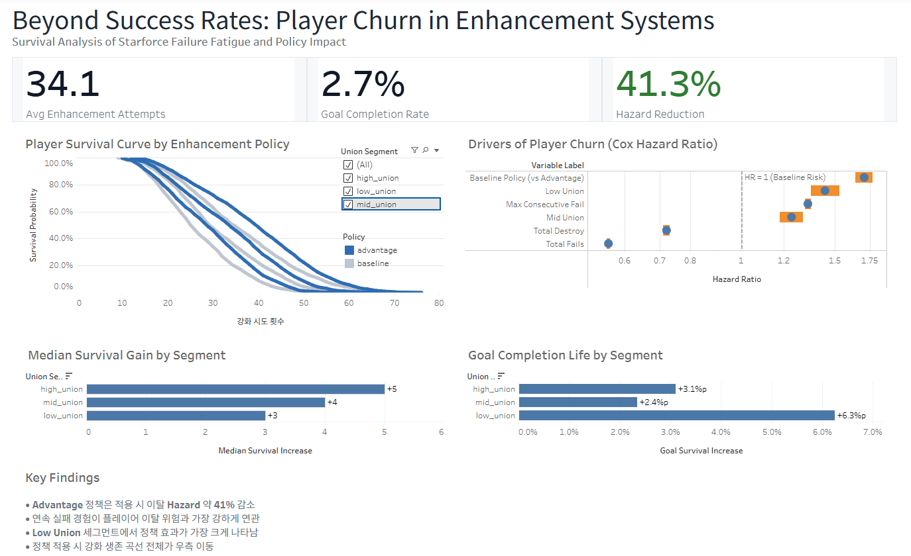

# Starforce Enhancement Survival Analysis

본 프로젝트는 강화 시스템에서 발생하는 유저 이탈을
단순 성공 확률 문제가 아닌 누적 스트레스 기반 Hazard 문제로 재정의합니다.

이를 통해 정책이 평균 성과를 개선하는지를 넘어서,
위험 구조 자체를 어떻게 변화시키는지를 정량적으로 검증합니다.

강화 정책이

- 임계점 도달 시점을 얼마나 지연시키는지
- 이탈 위험을 얼마나 낮추는지

를 Survival Analysis + Cox Regression으로 분석한 프로젝트입니다.

----------------------------------------------------------------

## Dashboard

본 프로젝트의 분석 결과는 Tableau 대시보드를 통해 시각적으로 확인할 수 있습니다.

**Tableau Public Dashboard**  
https://public.tableau.com/views/starforce_enhancement_survival_analysis/dashboard

### Dashboard Preview

대시보드는 다음 내용을 중심으로 구성되어 있습니다.

- Enhancement Policy별 Player Survival Curve
- Cox Hazard Ratio 기반 이탈 위험 요인 분석
- Union Segment별 생존 시간 증가
- 정책 적용 시 Goal(22성) 달성 확률 변화

정책 적용 시 생존 곡선이 전체적으로 우측 이동하며  
이탈 Hazard가 구조적으로 감소하는 패턴을 확인할 수 있습니다.

----------------------------------------------------------------

## 프로젝트 배경

강화 시스템에서 유저 이탈은 단순히 낮은 성공 확률 때문이 아니라,

- 반복된 실패 경험
- 연속 실패로 인한 감정 누적
- 고강화 구간에서의 리스크
- 파괴 이벤트

등이 복합적으로 작용한 결과라고 가정했습니다.

따라서 이탈을 다음과 같이 정의했습니다.

**누적 스트레스가 임계점을 초과하는 순간 발생하는 이벤트**

강화 시도 횟수를 시간(Time)으로 정의하고,
임계점 초과 시점을 Dropout으로 모델링했습니다.

----------------------------------------------------------------

## 핵심 모델 설계

### 유니온 구간별 임계점 설정

UNION_THRESHOLD = {
    "low_union": 180,
    "mid_union": 240,
    "high_union": 320
}

threshold = np.random.normal(
    UNION_THRESHOLD[union_segment],
    20
)

유니온 레벨이 높을수록 더 높은 강화 스트레스를 견디도록
각 세그먼트마다 평균값을 가지되 표준편차를 20으로 분포화하여
유저마다 스트레스 인내도가 동일하지 않다는 현실을 반영했습니다.

### 스트레스 누적 공식

stress += (
    1.2 * fails +
    3 * destroy +
    0.4 * (consecutive_fail ** 2)
)

스트레스는 다음과 같은 요소로 구성됩니다.

- 실패       -> 선형 증가
- 파괴       -> 고가중치
- 연속 실패   -> 제곱 패널티

----------------------------------------------------------------

## A/B 테스트 설계

두 가지 정책을 비교합니다.

### Baseline 정책

success_bonus = 0
destroy_reduction = 0

### Advantage 정책

success_bonus = 0.03
destroy_reduction = 0.03

각 세그먼트 * 정책당 2,000명 시뮬레이션

----------------------------------------------------------------

## 분석 파이프라인

Simulation
-> Statistical Test (t-test, z-test)
-> Kaplan-Meier Survival Analysis
-> Cox Proportional Hazards Regression
-> Goal Survival Probability (22성 도달 확률)
-> Bayesian Optimization

----------------------------------------------------------------

## Statistical Test 결과

### Mean 강화 시도 횟수 (tries_until_dropout)

| Union Segment | Baseline | Advantage | 차이 | t-test p-value |
|---------------|----------|-----------|------|----------------|
| low_union | 26.8715 | 29.279 | +2.41 | 3.56e-15 |
| mid_union | 31.34 | 33.893 | +2.55 | 3.94e-13 |
| high_union | 36.2415 | 39.234 | +2.99 | 1.37e-13 |

### Dropout Rate 검정 (z-test 기반)

- low_union: p = 0.000136
- mid_union: p = 3.30e-06
- high_union: p = 2.80e-15

모든 세그먼트에서 정책 차이는 통계적으로 유의 (p < 0.01)

----------------------------------------------------------------

## Kaplan-Meier Survival Analysis

### 생존 정의

- Time = tries_until_dropout
- Event = dropout
- Goal(22성) 도달 시 censor 처리

### Median Survival Time

임계점 도달까지의 중앙 강화 시도 횟수

| Union Segment | Baseline | Advantage | 증가폭 |
|---------------|----------|-----------|--------|
| low_union | 26 | 29 | +3 |
| mid_union | 30 | 34 | +4 |
| high_union | 35 | 40 | +5 |

### 해석

- 모든 세그먼트에서 Advantage 정책이 생존시간 연장
- 고유니온 구간에서 증가폭이 가장 크게 나타남
- 유니온 레벨이 높을수록 절대 생존 시간 증가

정책이 단순 평균 증가가 아닌,
**생존 곡선 전체를 우측으로 이동**시키는 구조적 변화임을 의미합니다.

----------------------------------------------------------------

## Cox Proportional Hazards Regression

### 모델

hazard ~ total_fails + total_destroy + 
         max_consecutive_fail +
         policy + union_segment

총 12,000 observations
Concordance = 0.96 (높은 예측력)

이는 모델이 유저 간 이탈 위험의 상대적 순위를 명확히 구분함을 의미합니다.

본 모델은 시간에 따라 누적되는 변수를 포함하므로,
일부 계수는 생존시간과의 구조적 공변성을 반영합니다.
따라서 해석 시 인과 효과보다는 위험 구조 설명 변수로 이해해야 합니다.

### 주요 Hazard Ratio (exp(coef))

Variable                HR          해석
------------------------------------------------------------------
total_fails             0.56        실패 누적이 많을수록 이탈 위험 감소
                                    (생존시간이 길어지는 구조 반영)

total_destroy           0.72        파괴 경험이 누적된 유저는
                                    더 오래 강화 지속

max_consecutive_fail    1.33        연속 실패 최대값 증가 시
                                    이탈 위험 33% 증가

policy_baseline         1.70        Baseline 정책은 Advantage 대비
                                    이탈 위험 70% 높음

union_segment_low_union 1.44        high_union 대비 low_union
                                    이탈 위험 44% 높음

union_segment_mid_union 1.24        high_union 대비 mid_union
                                    이탈 위험 24% 높음

total_fails의 HR < 1은 실패가 누적될수록 생존 시간이 길어진 유저에게만 관측되는 생존 편향 효과를 반영합니다.

### 해석

- Advantage 정책은 Baseline 대비 이탈 Hazard 약 41% 감소 (1 - 1/1.70)
- low_union 유저는 high_union 대비 Hazard 44% 높음
- 연속 실패는 구조적으로 가장 강한 리스크 요인 (HR 1.33)

이는 정책이 단순 평균 강화 횟수를 증가시키는 것이 아니라,
개별 유저의 위험 곡선 자체를 하향 이동시키는 효과를 가짐을 의미합니다.

즉, 정책은 기대값을 개선하는 것이 아니라 
시간 축 전반에서의 위험 함수를 구조적으로 이동시킵니다.

----------------------------------------------------------------

## 22성 Goal Survival Probability

Union Segment      Baseline        Advantage       증가폭
-----------------------------------------------------------
low_union           0.6330          0.6955          +6.25%p
mid_union           0.7755          0.7990          +2.35%p
high_union          0.8490          0.8800          +3.10%p

### 해석

- 정책 효과는 low_union에서 가장 큼
- 취약 세그먼트에서 목표 달성 확률 개선 효과가 큼
- 고유니온은 이미 높은 생존 확률 -> 증가폭 제한적

----------------------------------------------------------------

## Bayesian Optimization 결과

### 최적화 목표

maximize mean(tries_until_dropout)
Trial 수: 15

### Best Params

success_bonus = 0.0970
destroy_reduction = 0.0196
Best Mean Tries = 39.935

### 해석

- success_bonus는 상한에 수렴
- destroy_reduction은 중간 수준에서 수렴

- 성공 확률 증가가 생존 시간에 가장 큰 영향
- 파괴 감소는 보조적 효과
- 모델은 성공 확률 중심 정책을 선호

이는 유저 이탈이 파괴보다는 반복 실패 스트레스에 더 민감함을 시사합니다.

즉, Hazard 감소가 파괴 확률 하향보다 성공 빈도 증가에 더 민감하게 반응함을 시사합니다.

----------------------------------------------------------------

## 통합 결론

본 프로젝트는 강화 정책을 단순 확률 조정 문제가 아닌
Hazard Modeling 문제로 재정의했습니다.

실행 결과는 다음과 같습니다.

- Advantage 정책은 Baseline 대비 이탈 Hazard 약 **41% 감소**
- 생존 곡선 전체가 **우측 이동**
- **Low union 세그먼트**에서 정책 효과 최대
- 연속 실패는 가장 강한 이탈 위험 요인 (HR 1.33)
- 성공 확률 증가 정책이 생존 시간 증가에 가장 큰 영향

이는 강화 밸런스 설계를 기대값 중심이 아닌 
Hazard 최소화 관점으로 전환해야 함을 의미합니다.

즉, 강화 시스템 설계의 목표는 기대 강화 횟수 극대화가 아닌
이탈 위험 함수의 기울기 완화여야 합니다.

----------------------------------------------------------------

## 프로젝트 구조

starforce_hazard_retention_optimization/

├── config/
│ ├── dropout_config.py
│ ├── probabilities.py
│ └── union_config.py
│
├── core/
│ ├── simulator.py
│ └── stress_model.py
│
├── evaluation/
│ ├── cox_regression.py
│ ├── statistical_test.py
│ └── survival_analysis.py
│
├── experiment/
│ └── ab_test.py
│
├── optimization/
│ └── bayesian_optimizer.py
│
├── utils/
│ └── export_to_csv.py
│
├── output/
│
├── scripts/
│ └── export_dashboard_data.py
│
├── dashboard_data/
│
└── main.py

----------------------------------------------------------------

## 실행 방법

### 환경 세팅

python -m venv venv
venv\Scripts\activate
pip install -r requirements.txt

### 시뮬레이션 실행

python main.py
python scripts/export_dashboard_data.py

----------------------------------------------------------------

## 프로젝트 의의

기존의 강화 밸런스 설계는
**"성공 확률을 얼마나 조정할 것인가"**에 초점을 두었다면,

본 프로젝트는
**"유저의 이탈 Hazard를 얼마나 낮출 것인가"**
라는 위험 기반 설계 프레임워크로 확장했습니다.

또한 단순 A/B 테스트를 넘어,

Simulation
-> Statistical Test
-> Survival Analysis
-> Cox Regression
-> Bayesian Optimization

으로 이어지는 **일관된 리스크 모델링 구조**를 구축했습니다.
